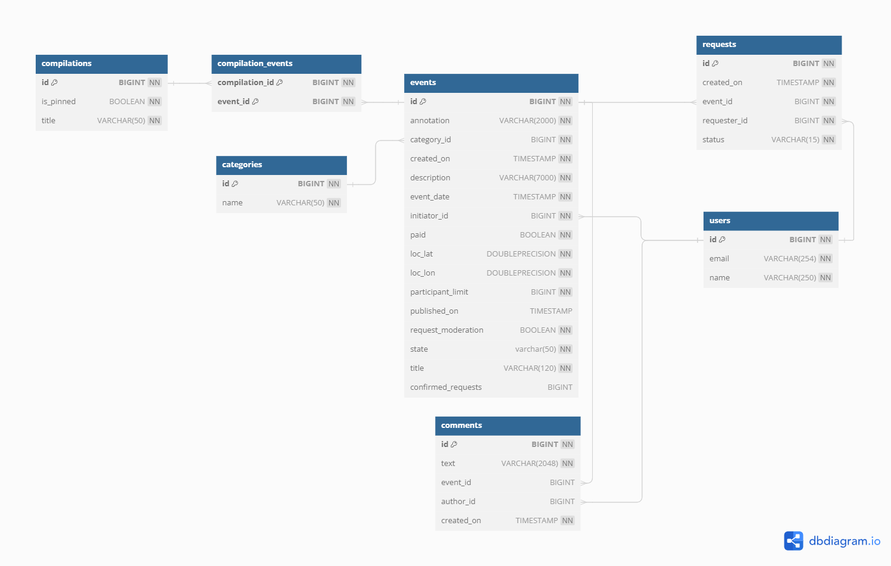

# **Event poster**

***Описание***

Приложение Explore-with-me - микросервисное REST приложение, которое позволяет пользователям делиться информацией об интересных событиях и находить компанию для участия в них.
По смыслу приложение представляет собой афишу. В этой афише можно предложить какое-либо событие от выставки до похода в кино и собрать компанию для участия в нём.

***Структура***
Приложение включает в себя 2-а модуля:
* основной сервис будет содержать всё необходимое для работы продукта;
* сервис статистики будет хранить количество просмотров и позволит делать различные выборки для анализа работы приложения.

***Функционал основного сервиса***

API основного сервиса разделите на три части:
* публичная будет доступна без регистрации любому пользователю сети;
* закрытая будет доступна только авторизованным пользователям;
* административная — для администраторов сервиса.

Аутентификация пользователей не включена в данную версию.

**Публичный API** предоставляет возможности поиска и фильтрации событий:
* сортировка списка событий организована либо по количеству просмотров, которое будет запрашиваться в сервисе статистики, либо по датам событий;
* при просмотре списка событий возвращается только краткая информация о мероприятиях;
* просмотр подробной информации о конкретном событии (через отдельный эндпоинт);
* каждое событие относится к какой-то из закреплённых в приложении категорий;
* настроена возможность получения всех имеющихся категорий и подборок событий (такие подборки будут составлять администраторы ресурса);
* каждый публичный запрос для получения списка событий или полной информации о мероприятии фиксируется сервисом статистики.

**Закрытая часть API** реализует возможности зарегистрированных пользователей продукта:
* авторизованные пользователи имеют возможность добавлять в приложение новые мероприятия, редактировать их и просматривать после добавления;
* настроена подача заявок на участие в интересующих мероприятиях;
* создатель мероприятия имеет возможность подтверждать заявки, которые отправили другие пользователи сервиса.

**Административная часть API** предоставляет возможности настройки и поддержки работы сервиса:
* обеспечивает добавление, изменение и удаление категорий для событий;
* имеется возможность добавлять, удалять и закреплять на главной странице подборки мероприятий;
* предусмотрена модерация событий, размещённых пользователями, — публикация или отклонение;
* также настроено управление пользователями — добавление, активация, просмотр и удаление.

Второй сервис — сервис статистики. Он будет собирать информацию. Функционал сервиса статистики содержит:
* запись информации о том, что был обработан запрос к эндпоинту API;
* предоставление статистики за выбранные даты по выбранному эндпоинту.

Сервис статистики состоит из 3-х модулей. 

***Спецификация API***
Для обоих сервисов разработана спецификация API:
* спецификация основного сервиса: ewm-main-service-spec.json;
* спецификация сервиса статистики: ewm-stats-service.json.

**В качестве дополнительной фичи в приложении реализована возможность добавления комментариев к событиям.**

Работоспособность дополнительной фичи проверяется за счет postman тестов. 

*Закрытая часть API* предполагает возможность следующих функций: 
* добавления комментариев к событиям
* получение комментария по id
* получение всех комментариев к событию с просмотром авторов комментариев 
* обновление ранее созданного пользователем комментария
* удаление ранее созданного пользователем комментария

*Административная часть API* предполагает возможность следующих функций:
* обновление любых комментарев
* удаление любых комментариев

*Публичный API* предполагает возможность следующего функционала:
* получение всех комментариев к событию с ***БЕЗ*** просмотра авторов комментариев

***Структура хранения данных***

**Основной сервис**

Диаграмма описывает структуру хранения данных приложения. Основные сущности приложения:
* Events - события
* Users - пользователи
* Categories - категории
* Requests - запросы
* Compilation - подборки
* Comments - комментарии

**Сервис статистики**
* Hits - просмотры

***Используемые технологии***

* Java 
* Spring Boot 
* Hibernate 
* Maven
* Docker
* Postman
